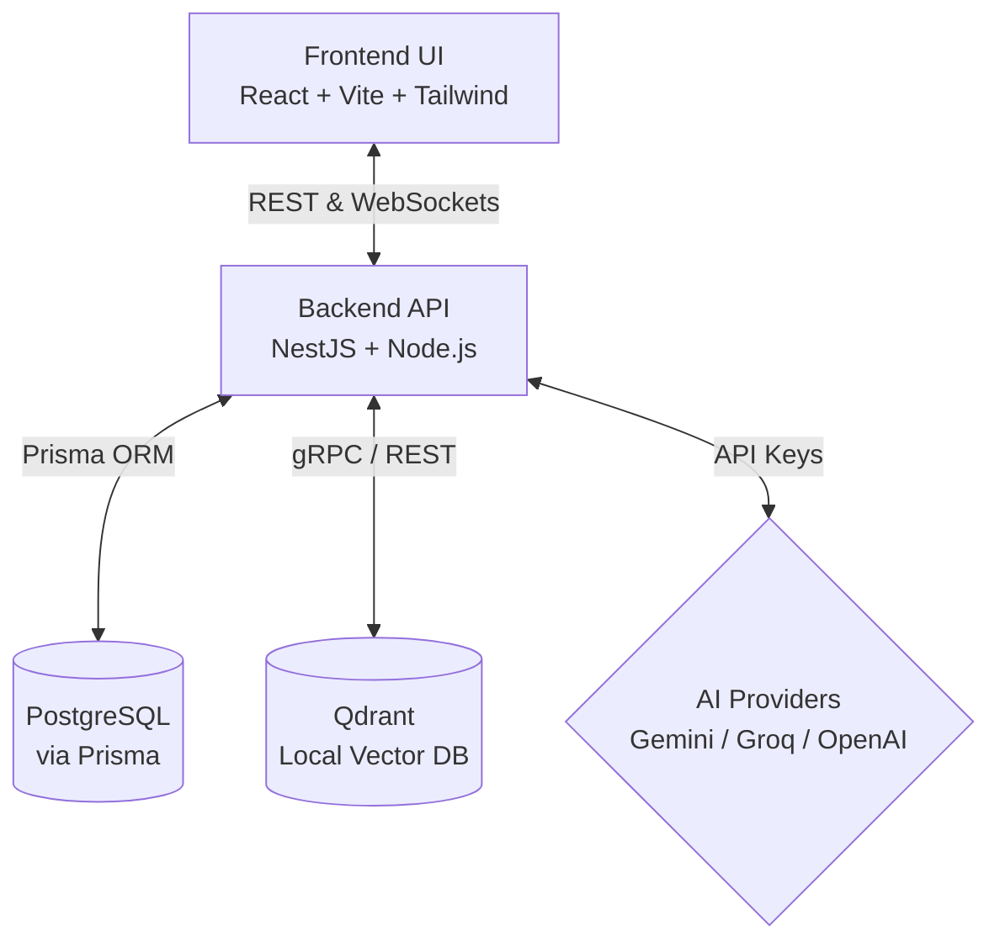

# Nebula AI Workspace

A full-stack, enterprise-grade AI reasoning workspace and developer intelligence platform. Nebula combines real-time intelligent chat, collaborative coding, multi-project file explorers, semantic document indexing (RAG), rate limiting, and code diagnostic analysis into a single, cohesive interface.

Designed with an ultra-premium aesthetic featuring sleek glassmorphic surfaces, curated color palettes, micro-animations, and bespoke skeleton loading states, Nebula represents the state-of-the-art in developer-focused AI tools.

---

## 🚀 Key Features

* **Intelligent Chat & Multi-Model Routing**: Seamlessly switch reasoning engines between Google Gemini, Anthropic Claude, and Groq (Llama) models, configured through dynamic provider routing.
* **Semantic Document & Code Retrieval (RAG)**: Parse, chunk, and embed user documents/code files into a local Qdrant Vector database for context-aware responses.
* **Real-time Coding Workspace**: Run and manage isolated developer workspaces with directory trees, code editing rails, and code diagnosis logs.
* **Static Analysis & Diagnostics**: Deep scan codebase modules for security issues, architectural violations, performance bottlenecks, and general bugs.
* **Premium UX/UI Design**: Modern glassmorphism, responsive navigation rails, interactive CLI command palettes (`Ctrl+K`), custom shimmer loaders, and responsive states.
* **Rate Limiting & Security Guardrails**: Out-of-the-box security policies, rate-limiting handlers, and CORS filters.

---

## 🛠️ Technology Stack

### Frontend (User Interface)
* **Core**: React 18, TypeScript, Vite
* **Styling**: Tailwind CSS v4, custom vanilla CSS tokens (theme variables)
* **UI Components**: Radix UI Primitives, Material-UI Icons, Framer Motion
* **Visualizations**: Recharts, Canvas Confetti, Embla Carousel

### Backend (API Server)
* **Framework**: NestJS (Node.js), TypeScript
* **Database & ORM**: PostgreSQL, Prisma ORM
* **Vector Store**: Qdrant Vector Database (via gRPC/REST)
* **Libraries**: RxJS, Socket.io (real-time events), PDF Parse, Axios

---

## 📐 System Architecture

Nebula uses a decoupled, modern architecture designed to scale. For full details on authentication flows and RAG ingestion pipelines, see the [Architecture Documentation](docs/documentation.md).

### High-Level Architecture Diagram



---

## 📂 Project Structure

```
nebula-ai-workspace/
├── backend/                  # NestJS backend API application
│   ├── prisma/               # Prisma Schema, migrations, and seed scripts
│   ├── src/                  # NestJS TypeScript source code
│   │   ├── config/           # App settings and environment loading
│   │   ├── database/         # Database module and connection setup
│   │   └── modules/          # Business logic modules (auth, AI, workspace, RAG, etc.)
│   ├── .env.example          # Backend environment variables template
│   ├── docker-compose.yml    # Database, Vector DB, and Redis compose definitions
│   └── package.json          # Backend package manifest
├── frontend/                 # React frontend application
│   ├── src/                  # React components, services, routes, and custom hooks
│   ├── .env.example          # Frontend environment variables template
│   ├── index.html            # Entry HTML point
│   └── package.json          # Frontend package manifest
├── docs/                     # Detailed architectural specifications and guides
│   ├── documentation.md      # Core system specs and workflows
│   └── production-checklist.md # Production readiness checklist
├── .gitignore                # Global git ignore configuration
└── README.md                 # Primary workspace documentation (this file)
```

---

## ⚡ Setup & Installation

Follow these steps to get Nebula AI Workspace running on your local machine.

### Prerequisites
* **Node.js** (v18.x or later)
* **NPM** (v9.x or later) or **PNPM**
* **Docker & Docker Compose** (for running databases locally)

---

### 1. Environment Configuration

You must create and configure `.env` files for both the frontend and backend using the templates provided.

#### Backend
Copy the template and configure your connection strings and API keys:
```bash
cp backend/.env.example backend/.env
```
Inside `backend/.env`, configure your database URL, Qdrant URL, and API keys:
* `DATABASE_URL`: Your PostgreSQL connection string.
* `GEMINI_API_KEY`: Google Gemini platform developer API key.
* `GROQ_API_KEY`: Groq API platform developer key.
* `JWT_SECRET`: Secure string used to sign user authorization tokens.

#### Frontend
Copy the frontend environment template:
```bash
cp frontend/.env.example frontend/.env
```

---

### 2. Spinning Up Local Services (Docker)

Use the Docker Compose configuration in the backend folder to launch a PostgreSQL instance and a local Qdrant Vector database:

```bash
cd backend
docker-compose up -d
```
This starts:
* **PostgreSQL** on port `5432`
* **Qdrant Vector DB** on port `6333` (dashboard at `http://localhost:6333/dashboard`)

---

### 3. Database Migration & Seeding

Navigate to the `backend` folder, install backend packages, run database migrations, and generate the Prisma Client:

```bash
cd backend
npm install
npx prisma migrate dev
npx prisma generate
```

---

### 4. Running the Applications

#### Start the Backend API Server
With databases configured and running:
```bash
cd backend
npm run start:dev
```
The backend API server will run at `http://localhost:4000`. Swagger API documentation is available at `http://localhost:4000/api` (if enabled in environment flags).

#### Start the Frontend React Web Client
Open a new terminal window:
```bash
cd frontend
npm install
npm run dev
```
The React frontend client will start at `http://localhost:5173`.

---

## 📸 Screenshots

*(Note: Add project screenshots here during deployment to showcase the dynamic dashboard, interactive code editor, and file explorer.)*

| Workspace Dashboard | Diagnostic Analysis |
|:---:|:---:|
|  |  |

---

## 🛠️ Production Verification

Before moving Nebula into production, ensure you complete and check off all steps detailed in the [Production Deployment Checklist](docs/production-checklist.md).

---

## 🔮 Future Enhancements

* **Deployment Automation**: Setup GitHub Actions CI/CD workflows for automated builds.
* **Persistent Embedding Cache**: Optimize embeddings by caching chunks in Redis.
* **Multi-language Diagnostic Scans**: Expand diagnostic analysis engine to support Python, Go, and Rust.
* **Real-time WebSockets Code Sync**: Fully collaborative, operational-transformation (OT) code editing sessions.

---

## 🤝 Contributing

Contributions are welcome! Please create a branch and open a Pull Request for any bug fixes, styling improvements, or new features.

---

## ✉️ Contact

For inquiries regarding this project or portfolio submissions, contact sivar@example.com or reach out via LinkedIn/GitHub.

---

## 📄 License

No License. All rights reserved. This project and code are created for placement portfolio and recruiter evaluation purposes.
