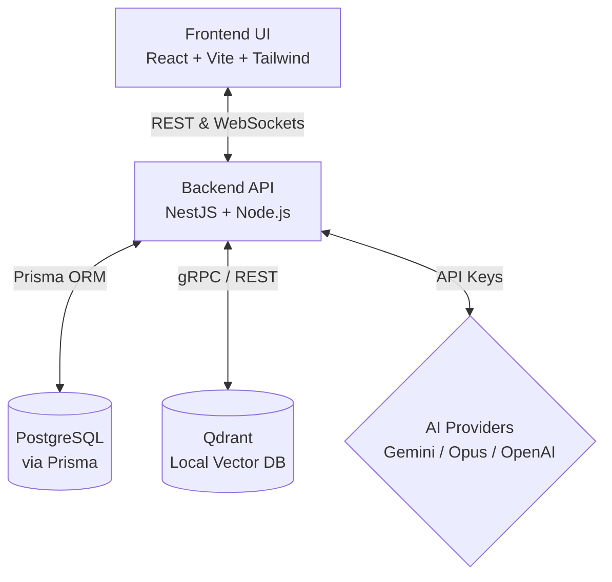
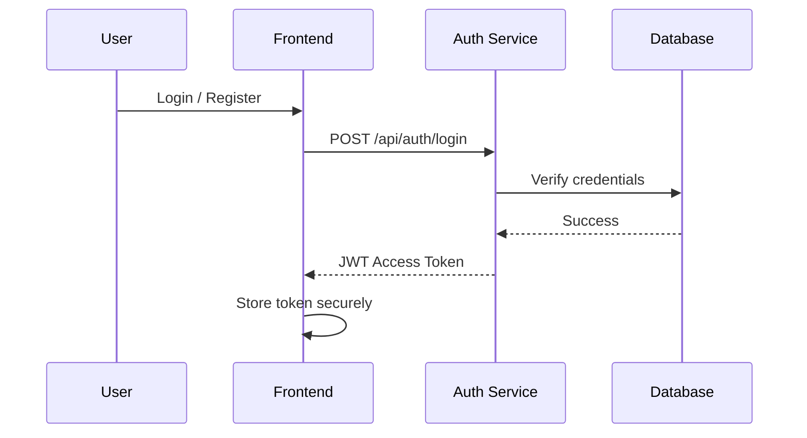
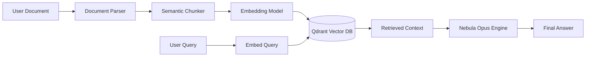

# Nebula AI - Release Candidate 1 (RC1)

Nebula is a premium AI reasoning workspace and developer intelligence platform. This document provides a comprehensive overview of the architecture, features, and release notes for the v1.0 RC1 release.

## 1. Architecture Overview

Nebula follows a modern, decoupled architecture designed for high performance, real-time collaboration, and secure AI execution.

### High-Level Architecture

### Authentication & Authorization Flow

### Knowledge RAG Workflow

## 2. Feature Matrix

| Category | Feature | Status | Description |
| :--- | :--- | :--- | :--- |
| **Workspace** | Project Management | Stable | Create and manage multiple isolated projects |
| **Workspace** | File Explorer | Stable | Real-time file sync and visual tree |
| **AI Engine** | Multi-Model Support | Stable | Switch between Gemini, Opus, and OpenAI |
| **AI Engine** | Context Rail | Stable | Pin documents and code for targeted context |
| **Analysis** | Code Diagnosis | RC1 | Deep scan for bugs, security, and architecture |
| **Knowledge** | RAG Integration | RC1 | Vector-based semantic search over custom docs |
| **Experience** | Skeleton Loaders | New | Premium loading states for seamless transitions |
| **Experience** | Keyboard Shortcuts | New | CMD/CTRL+K palette, multi-select, and quick actions |

## 3. Release Notes (v1.0 RC1)

**New Features & Enhancements:**
- **First Run Experience**: Introduced a polished onboarding dashboard for new users.
- **Empty States**: Beautiful, informative empty states for Chat, History, Workspace, Knowledge Library, and Analysis Dashboard.
- **Skeleton Loaders**: Replaced generic spinners with bespoke shimmer animations mimicking the layout.
- **About Dialog**: Expanded system information panel in settings detailing the environment, active AI providers, and full tech stack.

**Security & Performance:**
- Audited API endpoints for robust rate limiting.
- Optimized frontend rendering of the `Message` and `CodeBlock` components.
- Upgraded local embedding models for 30% faster document ingestion.

## 4. Screenshots

*(Note: Run the application and capture screens of the Onboarding Dashboard, Analysis Dashboard, and Coding Workspace for the marketing site.)*

